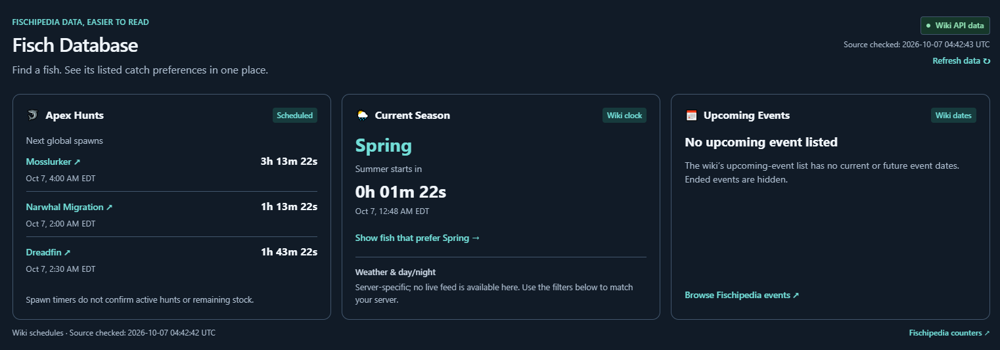
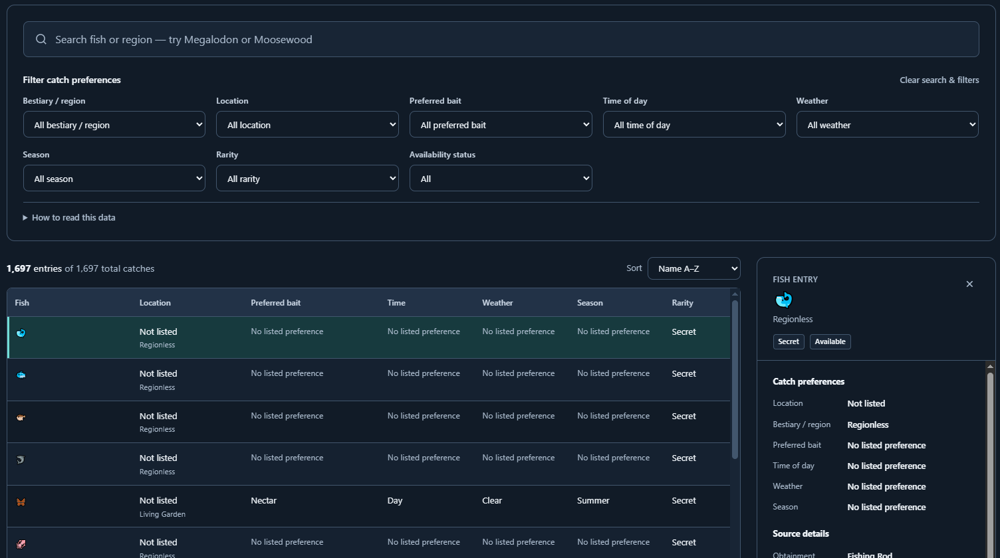

# Fisch Finder

https://fisch-finder-moonke1-0c07.wix-site-host.com/

A Fisch database for fish, rod, companion, and quest search on desktop and mobile. The search bar matches fish names, bestiary regions, and listed sublocations, with partial and case-insensitive matching. The interface offers desktop tables, mobile cards, responsive details, and light or dark mode.

## Source and data updates

The app reads Fischipedia's MediaWiki Bucket API at `https://fischipedia.org/w/api.php` using its `fish` and `fish_availability` buckets. `src/lib/fisch.ts` documents the exact fields and queries. Names, preferences, bestiary region, sublocation, fishing methods, GPS, events, and availability pools come from those fields.

Automatic API reads are cached for 30 minutes. The "Refresh data" button makes an uncached POST request that checks Fischipedia immediately, bypassing the normal application and edge caches. A successful check updates the source timestamp even when fish details have not changed. If requests fail, the last successful in-memory result or the bundled `src/data/fisch-snapshot.json` is shown with its original retrieval timestamp and a saved-data notice. The source is community-maintained wiki data; no game/server state is available here.

Empty preference lists are labeled "No listed preference", consistent with the wiki's FishInfobox template showing None when those parameters are empty. This does not imply a fish has no event, hunt, or other requirements. The detail view links to the original wiki page and its Obtainment section for special requirements.

MediaWiki serializes true Boolean fields as existing empty-string properties and omits false properties. Normalization explicitly accounts for this. Availability has two choices: Available (neither removed nor unobtainable is flagged) and Unavailable (either flag is set), with All as the default. The data legend explains that Available does not guarantee active server conditions; unavailable entries retain the wiki reason in their source details. Previous status URL values map to the new choices. Clicking anywhere in a table row opens details; the fish name remains a native keyboard-accessible button, and focus highlights its entire row.

## Rod Finder

The `/rods` page searches rods by name, journal region, obtainment method, and recommended enchantment. Filters include all listed stages (including Stage 0 / exclusive and missing stages), region, obtainment, enchantment, and availability. Sort by name, stage, lure speed, or luck. Rows and mobile cards open full stats, source information, and grouped enchant recommendations with mastery and relic conditions preserved. Search and filters can be shared through the URL. Desktop navigation shows all three pages; the mobile hamburger opens the same links.

`src/lib/rods.ts` reads the Fischipedia `rods` bucket and checks individual page revision IDs. Only changed pages need their recommendation text downloaded. Advice comes from each page’s Enchanting template; absent advice is labeled “No recommendation listed.” A bundled snapshot keeps the page usable during source outages. Automatic checks use a 30 minute server cache, and manual checks are limited to once per minute per server instance. New rods and changed stages or recommendations become searchable after a successful refresh.

## Companions

The `/companions` page searches companion names, locations, food, abilities, and obtainment requirements. Filter by location, event, obtainment method, ability type, and All / Available / Unavailable. Sort by name, location, or obtainment. Desktop rows and mobile cards open full abilities with cooldowns, base and max-level values, feeding requirements, gameplay notes, and Relic Construct's level-dependent buffs. Search, filters, and the selected companion are shareable through the URL.

`src/lib/companions.ts` reads Fischipedia's `companions` bucket and checks page revision IDs. Only changed companion pages need their ability and obtainment text downloaded. Automatic checks use a 30 minute server cache, and manual checks are limited to once a minute per server instance. A bundled snapshot and the last successful server result preserve search and details during outages; the source timestamp advances only after a complete successful check. New wiki companions and locations appear in search and filters after refresh. Availability reflects wiki flags, rather than active event conditions in a game server.

## Quest Helper

Search wiki-documented quests by name, NPC, fish, objective, reward, and location. Available guides show first, with location, quest type, and availability filters. Quests are grouped by NPC. Each row opens an expanded desktop guide or full-screen mobile menu with Overview, Step-by-step guide, Fish & rod checklist, and Rewards sections. Source steps preserve quantities, alternatives, mutations, prerequisite notes, GPS coordinates, and riddle/solution tables. Missing or variable details are labeled.

Fish objectives link to Fish Finder with catch preferences. Specific objective rods and mutation-method rods link to Rod Finder. General rod suggestions are labeled capacity options, with limits and level gates; mandatory equipment and mutation conditions take priority. Objective checkboxes save on the current device, with a memory fallback when storage is blocked, a reset for each guide, and shareable guide links. Progress does not sync with Roblox.

The backend discovers quests through the NPC bucket and Quest NPCs category, checks page revisions, and refreshes guides, catch data, and mutation methods with a 30-minute cache. Manual refresh is throttled to once a minute per server instance. New wiki quest NPCs become searchable automatically. Failed checks retain the last complete data and timestamp. Availability uses wiki removal flags; event access and player prerequisites still apply, and wiki coverage may be incomplete.

## Schedule Cards

Three responsive cards above search show scheduled global hunt spawns, the wiki-derived current season, and current/future event dates. `src/lib/schedules.ts` reads MediaWiki revisions for `Template:Main page settings/events`, `Template:Main page settings/seasonal events`, and `MediaWiki:Countdowns.js`. Only supported values are parsed; source JavaScript is never executed. The bundled raw response records its actual source-check time. Failed or incompatible refreshes keep the previous schedules and timestamp with a saved-schedules notice.

Schedules refresh on opening, every 15 minutes, and with Refresh data. Countdown text ticks locally every second and resynchronizes when the tab becomes visible. Hunt timers show next scheduled spawns, never active state or stock. The season uses the wiki's Unix-clock cycle; the season action resets search/filters and selects the listed preferred season. Weather/day-night are server-specific and are not fabricated. Expired events are hidden; future events count down to start, and events within their listed date range count down to their scheduled end without claiming verified game status. Exact dates display in the visitor's local timezone.

## Appearance

The always-visible navigation switch offers both light and dark mode (dark mode is default). A user's choice is stored locally, restored before first paint, preserved across Astro navigation, and synchronized across tabs. The same light/dark choice applies to Fish Finder, Rod Finder, Companions, and Quest Helper. If storage is unavailable, the choice remains in memory across navigation. All surfaces and text use shared semantic palette tokens, including native form controls, focus rings, table selection, warnings, status badges, and the footer. Disabled database controls retain readable text rather than lowering the opacity of the entire control.

## Development and Publishing

Source data: Fischipedia contributors, https://fischipedia.org/wiki/Fisch_Wiki . Data adaptations shared under CC BY-NC-SA 4.0, https://creativecommons.org/licenses/by-nc-sa/4.0/ . Individual source pages are linked from every result. This unofficial companion is not affiliated with Roblox or Fisch.

Secondary source: Fisch Wiki contributors, https://fisch.fandom.com/wiki/Fisch_Wiki . Fandom-derived adaptations retain the source's CC-BY-SA licensing, https://www.fandom.com/licensing . They are identified separately from the primary source's license above. Test fixtures retain representative source excerpts solely to validate parsing and attribution.
